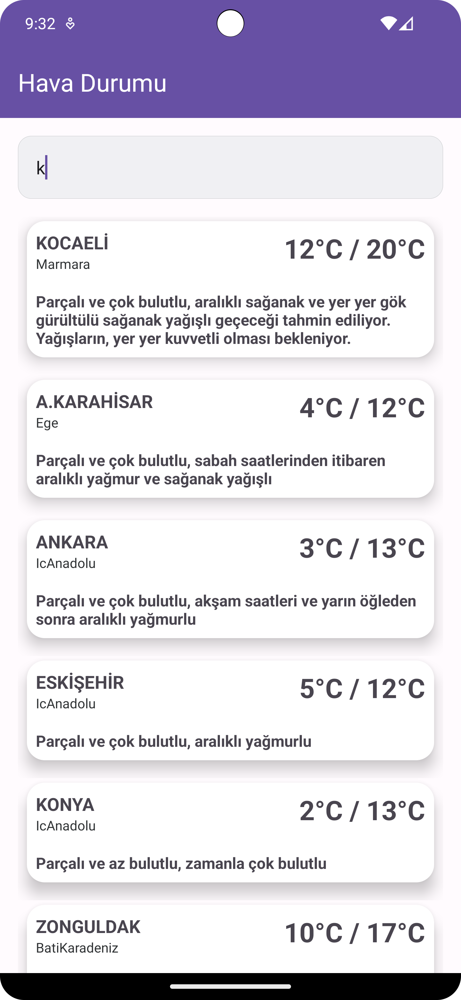

# JsoupWeatherApp

# Showing data with RecyclerView
 
In this project, weather data captured with jsoup is shown with recyclerview.


## Data Received Link

```
https://www.mgm.gov.tr/FTPDATA/analiz/sonSOA.xml

```

## Screenshots 
<p float="left">
   &nbsp;
   &nbsp;
</p>


